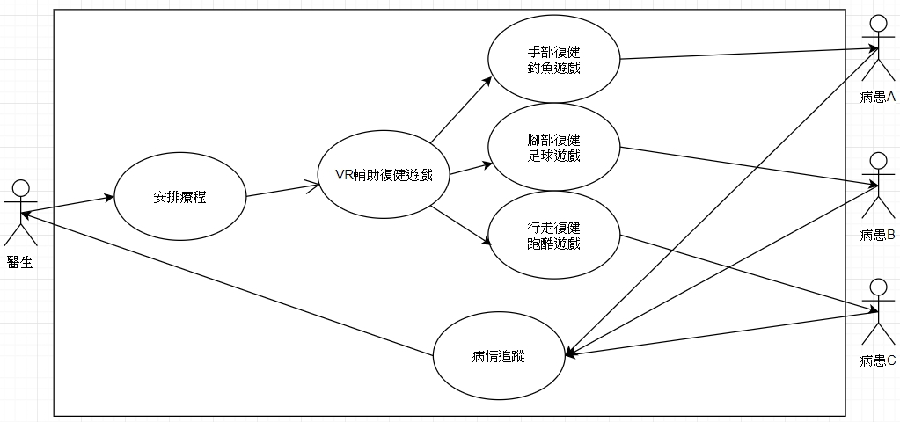

* **學號0624076 姓名:賴炳維:smile:**
* 學號0624032 姓名:黃偉傑 :smile:
* 學號0624058 姓名:陳宗順 :smile:
* 學號0624098 姓名:江維欣 :smile:

### 1. 智慧復健AR系統
### 2. 文字敘述專題需求:
   `透過VR的系統輔助下，讓復健病患能夠更具有意願從事復健項目。`
### 3. 寫出專題之功能性需求與非功能性需求
    (1) 功能性 `VR頭戴式設備、體感輔助式手把
    (2) 非功能性 `病人病歷隱私、遵循保險業標準`
### 4. 畫出 使用案例圖 (use case diagram)
    
### 5. 由上而下 排出 使用案例的重要性
   手部復健("釣魚遊戲"):fish:
   腳部復健("足球遊戲"):soccer:
   行走復健("跑酷遊戲")
### 6. 寫出 其中的 至少三個使用案例
    1.透過釣魚的遊戲，遊戲內的魚上鉤之後，透過手把震動。使用者必須扣下板機。將把手往上抬起。促建手腕跟手臂的訓練藉此達到復健的效果
    2.透過足球遊戲，在遊戲內會有碼數提升的機制，讓使用者透過腿抬越高。才能將球踢越遠。藉此逐步提升腳部的肌肉訓練量。
    3.透過跑酷遊戲，遊戲內有累計積分制。行走的越久分數越高。藉由持續行走鍛鍊整體下肢的肌肉耐力。
### 7. 寫出 user story
在這個逐漸高齡化的社會中。老人的身體健康及長照也成為未來的熱門議題。老人身體機能退化快速。若沒有定期運動或進行復健，肌肉萎縮特別快。
然而復健這麼部分所從事的活動往往枯燥乏味，令人從事意願不高。因此想透過VR的沉浸感以及對遊戲上的歡樂感來促進並改善大眾對於復健上的認知。
